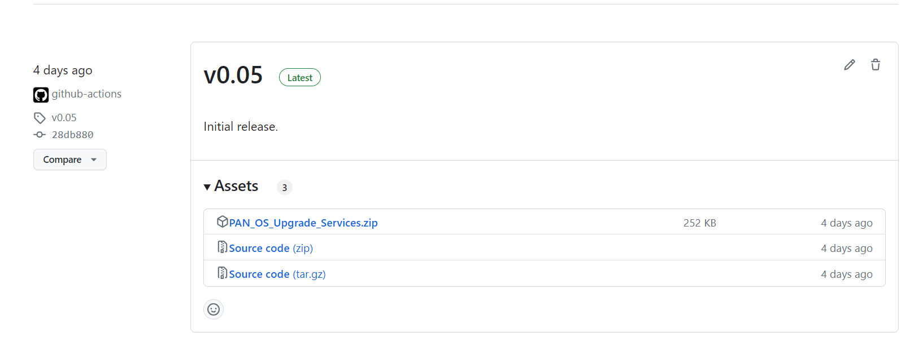
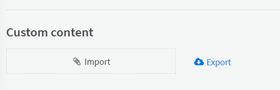

# Installation

## Requirements

 * XSIAM Enterprise + TIM License
 * Panorama(s) deployed
 * Network access between Cortex XSIAM and Github Container Registry
 * Network access between Cortex XSIAM (direct or via engine) to the Panorama(s)

## Installing the pack

1. From the [Github releases page](https://github.com/PaloAltoNetworks/xsoar-panos-upgrade-automation/releases), chose the latest release.
2. Download the Upgrade Services zip file.

3. In your XSIAM server, navigate to Settings->Configurations->Server Settings.
4. Towards the bottom of the page, in the "Custom Content" section, upload the zip file. It can take up to 5 minutes to upload to the server

## Configuring the integrations

1. Obtain a Panorama API key and add an XSIAM credential, saving the API key as the password.
    * **NOTE:** For multiple Panorama cases, you will need to have an XSIAM credential for each Panorama
1. Obtain an XSIAM API key and add an XSIAM credential, saving the API id as the user and key as the password.
1. Configure the Core Rest API integration.
1. Configure an instance of the "Palo Alto Networks PAN-OS" integration - ensuring you're using a Panorama server and not connecting directly to a NGFW.  Use the Panorama XSIAM credential for authentication
    * **NOTE:** For multiple Panorama cases, you will need to have a copy of each of the PAN-OS integrations for each Panorama
1. Configure the "PAN-OS Assurance Testing" integration.  Use the Panorama XSIAM credential for authentication.  Also, the "Panorama URL" in this integration should match the "Server URL" field from the "Palo Alto Networks PAN-OS" integration
    * **NOTE:** If the URLs don't match, then the integrations will not be tied together properly and integration commands will fail
1. Configure the "PAN-OS Device Management" integration.  This requires both the Panorama XSIAM credential and the XSIAM credential.  As with the previous integration, the "Panorama URL" needs to match.
    * **NOTE:** For multiple Panorama cases, the "Lookup Table Name" value should be unique for each Panorama, otherwise, the different instances will overwrite each other
    * **NOTE:** If the URLs don't match, then the integrations will not be tied together properly and integration commands will fail

Optionally:

1. Configure the Palo Alto Networks Security Advisories Integration

Now you should be done. You'll see your connected firewalls appear under Threat Intel, and be able to launch upgrades
and assurance testing from there.